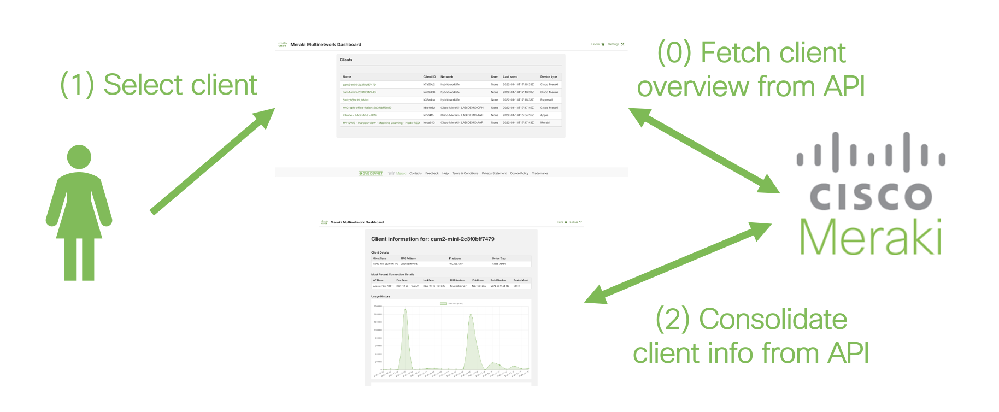
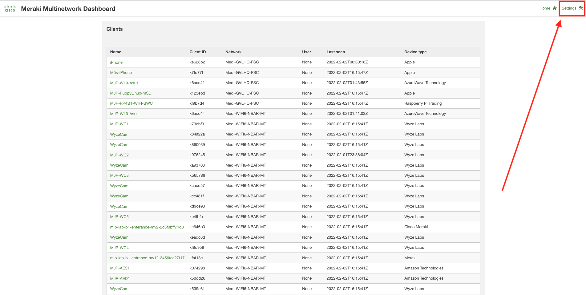
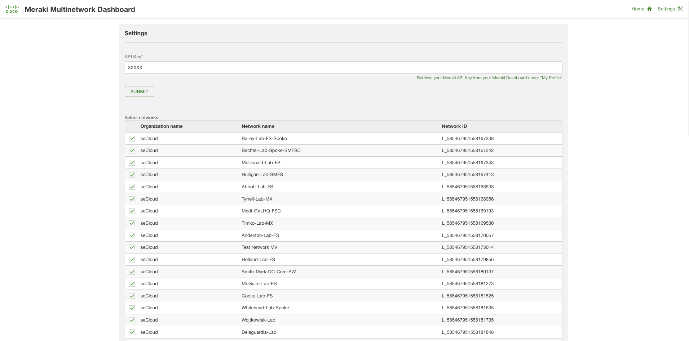
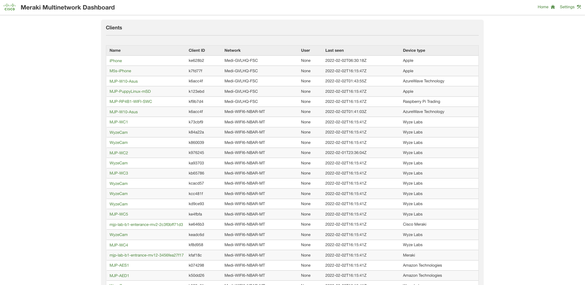
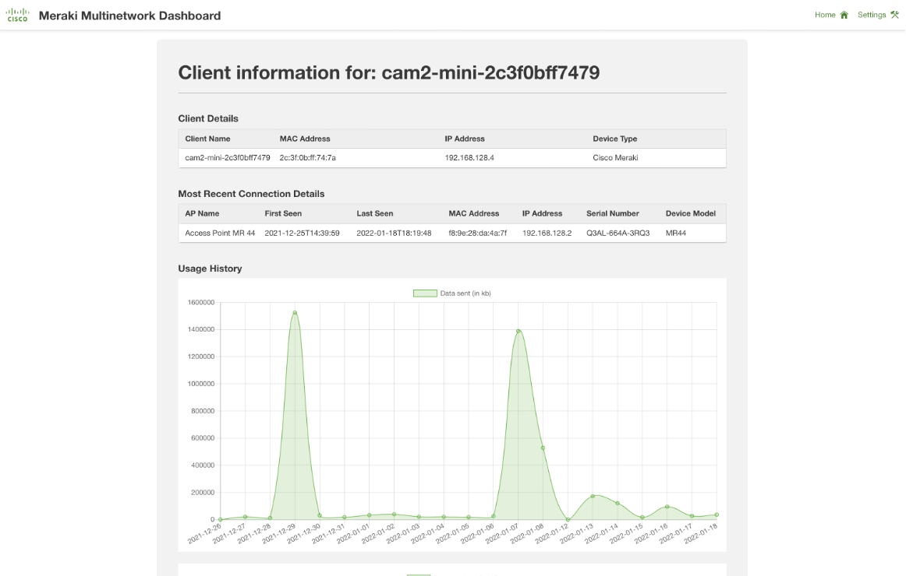
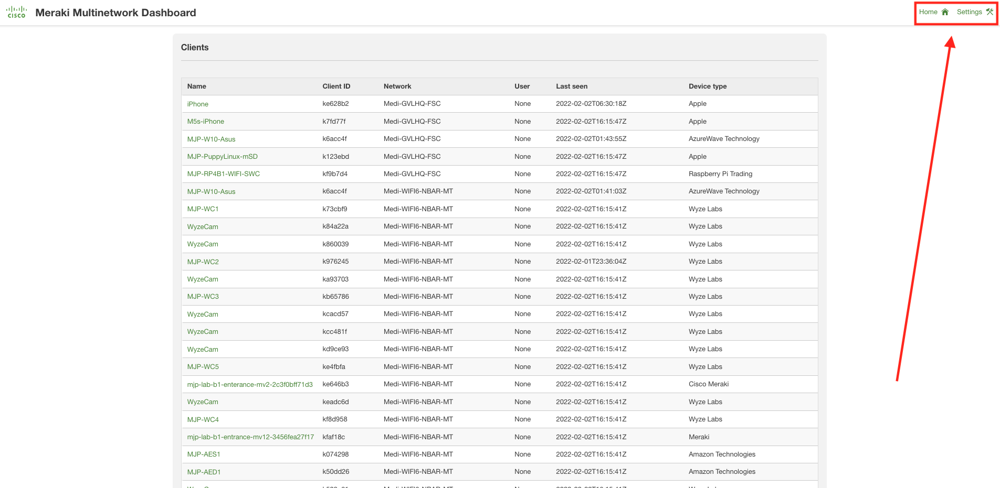

# GVE DevNet Multinetwork Dashboard
This prototype consolidates wireless client information across Meraki networks. It shows a list of clients seen, their network traffic, and their movement across networks. Moreover, it cross-launches the Meraki dashboard when the customer wants a deep-dive into an individual client’s information. 

## Contacts
* Stien Vanderhallen

## Solution Components
*  Meraki REST API
*  Meraki

## High Level Overview



## Installation/Configuration

0. In your terminal, clone this repository

```
$ git clone https://wwwin-github.cisco.com/gve/gve_devnet_meraki_multinetwork_dashboard.git
$ cd gve_devnet_meraki_multinetwork_dashboard
```

1. In `settings.json`, enter your Meraki API key as `YOUR_MERAKI_API_KEY`. (You can find your Meraki API key under `My Profile` after logging into the [Meraki Dashboard](https://dashboard.meraki.com))

2. Install the required Python libraries

```
$ pip install -r requirements.txt
```

3. Start the application

```
$ python3 app.py
```

4. In a browser, navigate to `localhost:7777`

5. In the top right corner, click `Settings`



6. In the settings page, check your API key, click `Submit` and select the networks you want to monitor.



7. Click `Save & Run`. You will be automatically redirected to the landing page.


## Usage

1. On the landing page (`localhost:7777`), consult the list of wireless clients across your selected networks.



2. Click on a client's name to consult the corresponding data. (**NOTE:** This action will also cross-launch the Meraki dashboard as showing the corresponding client data.)



3. At any time, you can go back to the landing page, respectively the settings page by using the top right icons.



# Screenshots

- Settings page


- Landing page


- Client overview


### LICENSE

Provided under Cisco Sample Code License, for details see [LICENSE](LICENSE.md)

### CODE_OF_CONDUCT

Our code of conduct is available [here](CODE_OF_CONDUCT.md)

### CONTRIBUTING

See our contributing guidelines [here](CONTRIBUTING.md)

#### DISCLAIMER:
<b>Please note:</b> This script is meant for demo purposes only. All tools/ scripts in this repo are released for use "AS IS" without any warranties of any kind, including, but not limited to their installation, use, or performance. Any use of these scripts and tools is at your own risk. There is no guarantee that they have been through thorough testing in a comparable environment and we are not responsible for any damage or data loss incurred with their use.
You are responsible for reviewing and testing any scripts you run thoroughly before use in any non-testing environment.